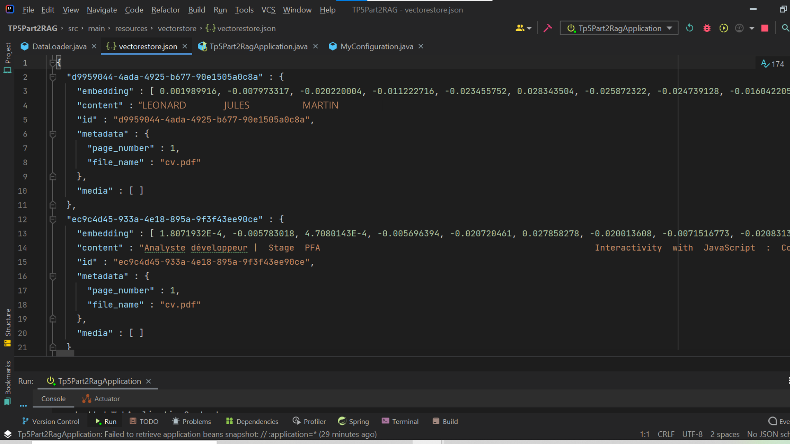
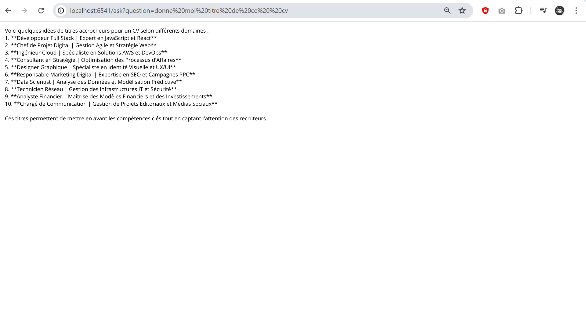
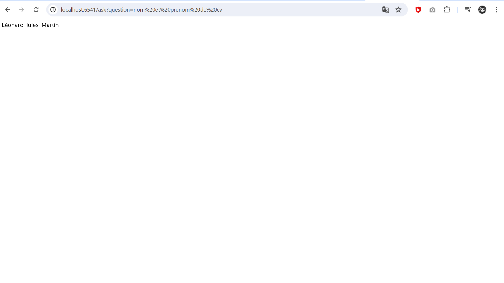
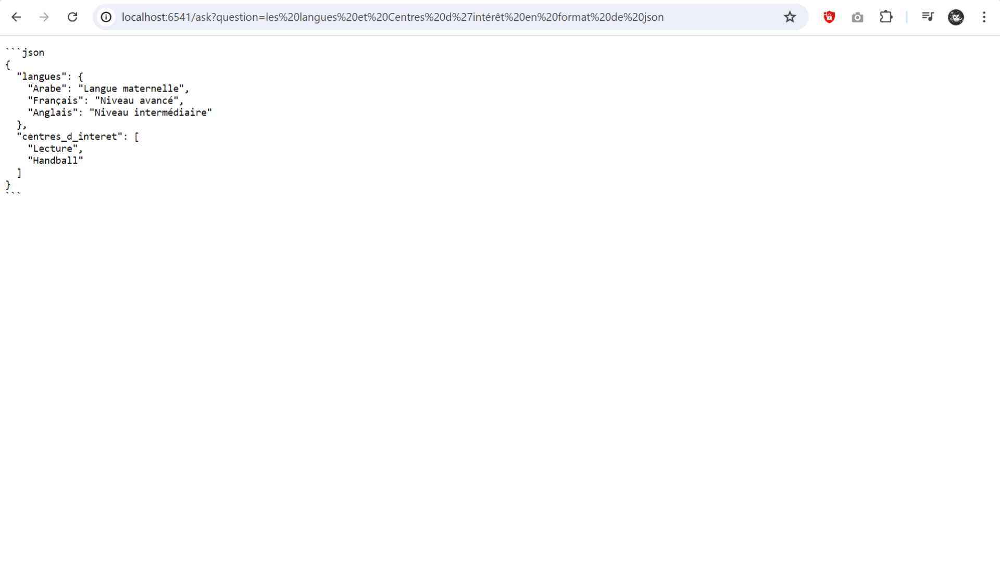
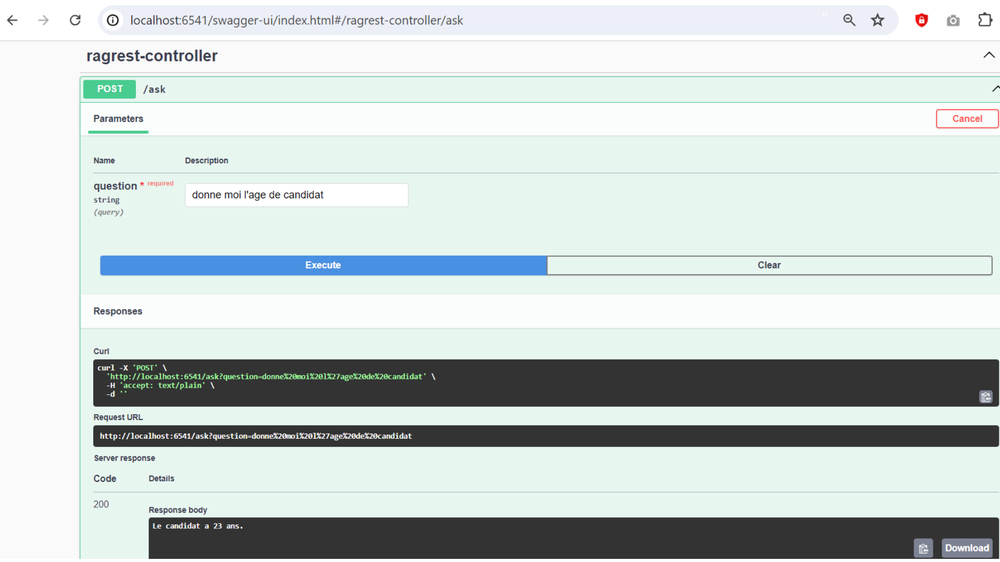
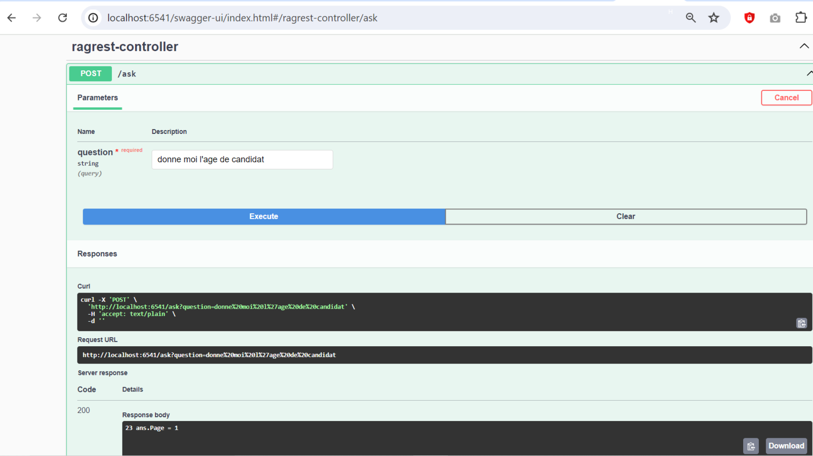

<h1>Récupération d'Information (RAG)</h1>
<h3>VectorStore</h3>

<h3>Cette capture illustre le résultat d'une requête HTTP GET exécutée sur une application développée avec Spring Boot.</h3>

<h3>Ce visuel montre également une réponse à une requête HTTP GET exécutée via une application Spring Boot.</h3>

<h3>La page web présente une réponse au format JSON, qui contient des informations sur les compétences linguistiques et les centres d'intérêt.</h3>

<h3>Documentation Swagger</h3>

